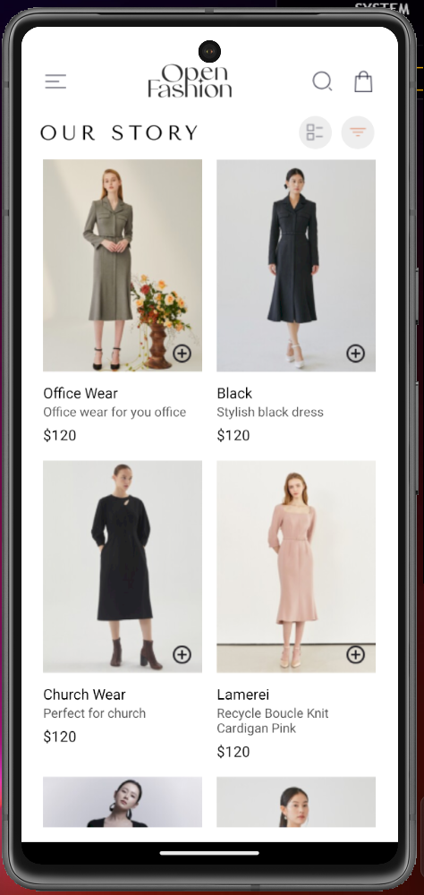
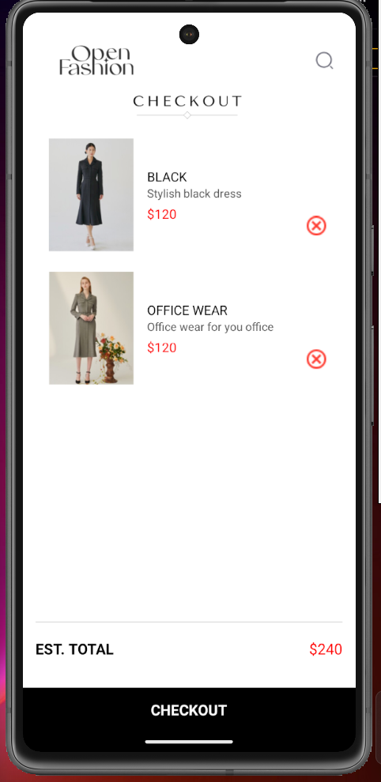

# ID - 11091069

# React Native Assignment 2

This project is a simple React Native application created with Expo CLI.

## ShoppingApp

ShoppingApp is a simple React Native application built using Expo. It allows users to view a list of products, add them to a cart, and view/remove items from the cart. The app utilizes local storage to persist the cart data between sessions.

## Design Choices

### Component-Based Architecture

- **HomeScreen**: Displays a list of available products.
- **CartScreen**: Displays selected items in the cart.
- **ProductCard**: A reusable component for displaying individual products.
- **CartItem**: A reusable component for displaying items in the cart.

### Navigation

- Utilizes React Navigation to switch between the HomeScreen and CartScreen.

### State Management

- Uses React hooks (`useState`, `useEffect`) to manage the state within components.

### Local Storage

- Uses `@react-native-async-storage/async-storage` to persist the cart data on the device.

## Screenshot

